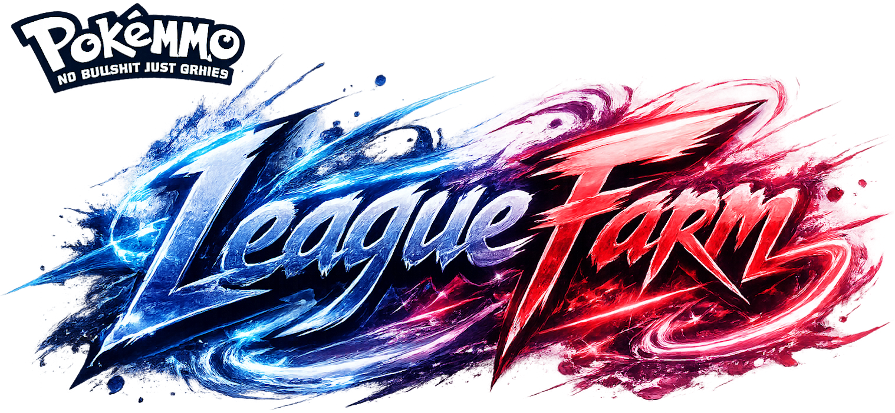

# PokeMMO Elite Four Farming Guide

<p align="center">
  
</p>

<p align="center">
  
  
  
  
  
</p>

Visual guide for farming PokeMMO Elite Four rematches by region, trainer, and opposing Pokémon.

**v1.0.0 is the stable Spanish portfolio release.** The app focuses on fast decision-making during battles: select a region, pick the Elite Four member or Champion, choose the opposing Pokémon, and follow the recommended strategy.

## Live demo

```text
https://noisgit.github.io/EliteFourPokeMMO/
```

## Release status

```text
Current release: v1.0.0
Status: Stable portfolio version
Language: Spanish
```

## Features

- Responsive interface built with React, TypeScript, Vite, and Tailwind CSS.
- Stable Spanish content for Elite Four farming routes.
- Dynamic strategy loading from JSON files grouped by region and trainer.
- Redesigned cards for regions, trainers, Pokémon, and strategy steps.
- Pokémon HOME sprites with Scarlet/Violet, Gen 8, animated, and local fallbacks.
- Smooth auto-scroll from Pokémon cards to the selected strategy.
- Direct strategy links through URL parameters for sharing exact matchups.
- Copy strategy button for quickly sharing the selected route.
- Dark and light theme support.
- Pokéball-style entry intro shown once per browser session.
- Team preview modal using a local image asset.
- Mobile-first responsive polish with desktop spacing improvements.
- Context-aware boost notes for common setup routes.
- GitHub Pages deployment from the `main` branch.

## Battle strategy notes

Strategy text is intentionally short and direct. The goal is to explain what to do on each turn without turning each route into a long paragraph.

Each strategy JSON should keep the opening action in `initialMove` and move conditions, branches, and follow-up steps into `tricks` and nested `variant` entries.

Boost values are contextual. Do not read every `+2`, `+4`, or `+6` as the same stat.

Examples:

- `Gengar +2/+4` means using **Nasty Plot** until the requested Special Attack boost.
- `Gengar +4 and +2 Speed` means using **Nasty Plot** until +4 Special Attack and **X Speed** for +2 Speed.
- `Poliwrath +6` means using **Belly Drum** to maximize Attack.
- `Volcarona +1/+2/+3` means stacking **Quiver Dance**.
- `X Speed` gives the Speed boost when the route asks for it.
- `X Accuracy` gives the Accuracy boost when the route asks for it.
- Pivots should be described clearly, for example: `Politoed enters as a pivot`.
- If a Pokémon must be used to bring another teammate safely, describe it as entering as a pivot or being weakened.

## Requirements

- Node.js 20 or higher is recommended.
- npm.

## Installation

```bash
git clone https://github.com/NoisGit/EliteFourPokeMMO.git
cd EliteFourPokeMMO
npm install
```

## Local development

```bash
npm run dev
```

Open:

```text
http://localhost:5173
```

## Build

```bash
npm run build
```

The production build is generated in:

```text
dist/
```

## Security checks

Run the dependency audit before merging dependency updates:

```bash
npm run security:audit
```

See [`SECURITY.md`](./SECURITY.md) for the project security policy.

## GitHub Pages deployment

The project is configured to deploy automatically with GitHub Actions when changes are pushed to `main`.

The Vite base path is:

```ts
base: '/EliteFourPokeMMO/'
```

Production URL:

```text
https://noisgit.github.io/EliteFourPokeMMO/
```

## Project structure

```text
src/
  assets/          Local images and visual assets
  components/      UI components
  data/            Spanish strategy JSON files by region and trainer
  hooks/           Dynamic data loading
  i18n/            UI copy
  interfaces/      TypeScript interfaces
  utils/           Sprite and strategy helpers
```

## Strategy data structure

Strategies are stored as JSON files. Each Pokémon has a single opening action and a list of strategy steps.

```json
{
  "id": "slowbro",
  "name": "Slowbro",
  "image": "/placeholder.svg?height=80&width=80",
  "initialMove": "Usa Trampa Rocas.",
  "tricks": [
    {
      "detail": "Si entra Lucario.",
      "variant": [
        {
          "detail": "Cambia a Gengar y usa Otra Vez.",
          "variant": [
            {
              "detail": "Gengar usa Maquinación hasta +4 y Velocidad X para +2 Velocidad.",
              "variant": []
            }
          ]
        }
      ]
    }
  ]
}
```

## English tooling note

The public v1.0.0 release is Spanish-only. Experimental English generation scripts are kept in `scripts/` for future work, but they are not part of the public release flow.

## Development workflow

Use small branches and pull requests.

Branch flow:

```text
feature/* / fix/* / chore/* / docs/* → develop → main
```

Rules:

- `main` is production and deploys to GitHub Pages.
- `develop` is the integration branch for ongoing work.
- Feature, fix, chore, and docs branches must open pull requests into `develop`.
- When `develop` is stable, open a release pull request from `develop` into `main`.
- Pull requests and commit messages should be written in English.
- Issues and gameplay task descriptions can be written in Spanish.
